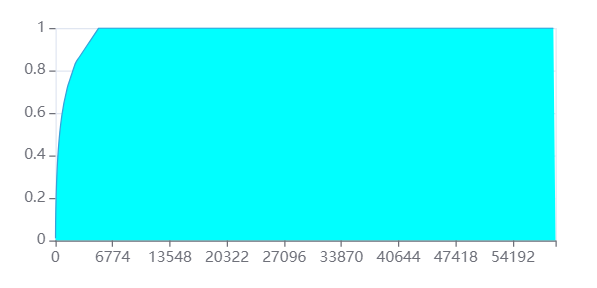
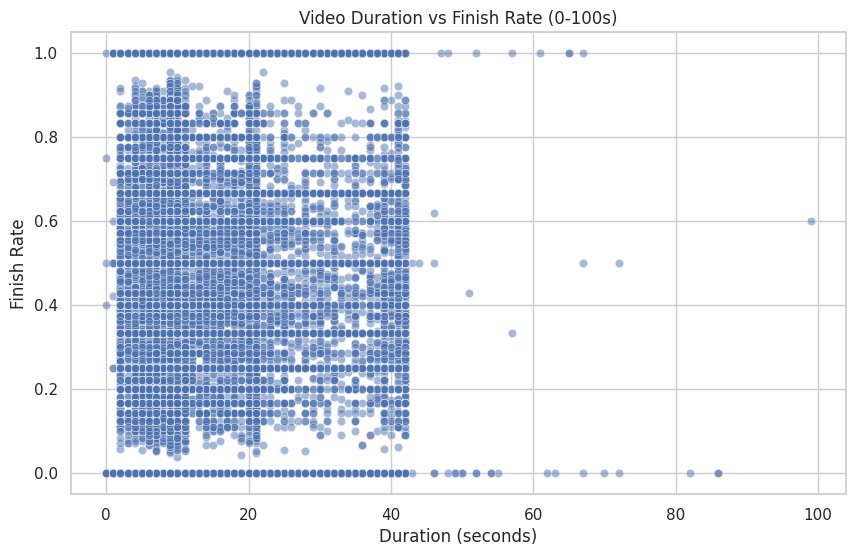

## 抖音用户点赞行为预测模型分析

- 报告日期: 2025.4.27
- 报告人：许康哲、刘勇奇、张开元、潘弈铭、王守臻
- 时间：2025.4.1 至 2025.4.27

### 一、项目进展概述

任务共分为特征指标构建，用户、作者、作品数据可视化分析，用户与作者聚类分析，浏览行为中的点赞预测，以及可交互界面。已完成前面的特征指标构建可视化分析、聚类分析和点赞预测任务。可交互界面正在进行开发。

### 二、详细进展报告

#### 1. 数据准备阶段

- 完成情况：100%
- 已完成工作：
	- 数据下载：使用和鲸社区的[抖音用户数据集](https://www.heywhale.com/mw/dataset/5fcc89d41a34b90030b0c65f)。该数据集包含抖音2019年的用户点赞行为数据，共计170万条。
	- 数据质量：数据中不含缺失值和异常值，无需额外处理。

**数据集说明**  

|      字段名       |   释义   |    字段名     |   释义   |    字段名    |   释义   |  
| :---------------: | :------: | :-----------: | :------: | :----------: | :------: |  
|      **uid**      |  用户id  | **user_city** | 用户城市 | **item_id**  |  作品id  |  
|   **author_id**   |  作者id  | **item_city** | 作者城市 | **channel**  | 作品频道 |  
|    **finish**     | 是否看完 |   **like**    | 是否点赞 | **music_id** |  音乐id  |  
| **duration_time** | 作品时长 | **real_time** | 具体发布时间 | **H、date**  |  时、天(发布)  |

其中每一条数据都是由用户主动发起的，与创作者视频进行交互的行为记录，包括

- 什么人(用户)
- 看了谁的(作者)
- 什么视频(作品、发布时间、音乐、时长)
- 是否看完
- 是否点赞
- 音乐和时间等

#### 2. 初步分析阶段

完成情况：100%

已完成工作：

- 特征指标构建
- 用户数据分析
- 作者数据分析
- 作品数据分析
- 用户与作者聚类分析

关键发现：

大部分数据都出现了长尾效应，即少量用户产生了大部分的互动行为，大量用户只有很少的互动行为。

##### 2.1 **特征指标构建**

可以将浏览行为的数据简单的分类为以下四种：

1. 用户信息：$uid，user\_city$  
2. 作品信息：$item\_id, item\_city, channel, music\_id, duration\_time, real\_time, H、date$  
3. 作者信息：$author\_id$  
4. 浏览行为描述：$finish, like$  

同时可以从浏览行为中抽象出：用户、作品、作者、音乐、城市等实体，在本项目中，我们从用户、作者和作品三个角度进行分析。

##### 2.2 **可视化分析**

(1)用户指标分析

- 不同浏览量用户占比

- 用户累计浏览量占比

- 不同点赞量用户占比

- 用户累计点赞量占比

其中5.8%的用户点了90%的赞

- 完整观看情况

- 用户观看作品的评价时长

- 用户去过的城市数分布

(2)作者指标分析

- 作者作品产出数量分布

大部分作者或为业余作者，只发布少量作品；少部分作者发布大量作品，最多达上千条。呈现显著长尾分布。

- 作者点赞率分布

对数映射下，点赞率分布较为平滑，主要集中在0.01~0.1区间。

- 作者完播率分布

完播率两极化明显，0.0附近代表被刷到后直接滑走，可以作为用户偏好程度的判断标准。

- 作者活跃时间分析

作者活跃时间分布图呈现出典型的夜间高峰、白天低谷模式，

- 用户-作者交互关系

大部分用户只浏览了很少的作者（集中在1-10个作者之间），呈现显著的幂律分布，表示多数用户有自己的偏好作者；反之同理。

(3)作品指标分析

- 作品时长与完播率关系

在<40s区间内，完播率和视频时长无显著关联。

- 发布时间与完播率关系

完播率随发动时间有一定波动，但整体影响不大。

- 频道互动率分析

综合来看，Channel 2最受人喜欢，完播率和点赞率都居高。

- 城市分布与点赞率

主要城市中，点赞率随城市变化明显，差值最多可达0.005，最高和最低相差近一倍。

- 背景音乐使用情况

可以观察到抖音作者有明显的音乐选取偏好（即抖音神曲）。

- 时长区间与完播率关系

发布时长和完播率没有显著关联。

- 发布距今（假设今天是当年最后一天）时长与点赞率关系

发布至今越近的作品点赞率反而越高，推测是因为太久之前的作品热度消退后浏览量仍会增长，但点赞用户增速降缓。

(4)用户与作者聚类分析

读取前面处理的用户特征和作者特征，选取不同的K值，并绘制SSE和SC轮廓系数图：

选择k=4作为用户和作者特征聚类模型。

用户聚类的4个簇中心的特征

作者聚类的4个簇中心的特征

#### 3. 方法实现阶段

完成情况：100%

##### 已实现的技术

###### 已测试模型：
- **逻辑回归 (LogisticRegression)**：使用liblinear求解器，C=100.0
- **朴素贝叶斯 (GaussianNB)**：基础高斯朴素贝叶斯实现
- **决策树 (DecisionTreeClassifier)**：使用平衡类权重设置
- **随机森林 (RandomForestClassifier)**：初始使用100棵决策树，后优化至1000棵

###### 各模型性能比较：
|模型|准确率|AUC|
|---|---|---|
|逻辑回归| 0.98054 |0.499|
|朴素贝叶斯|0.98016|0.531|
|决策树|0.96017|0.501|
|随机森林(优化前)|0.98054|0.521|
|随机森林(优化后)|0.99065| 0.563 |

根据AUC值，优化后的随机森林模型表现最佳。

##### 模型调优：

###### 超参数优化过程与结果：
- **参数解耦优化策略**：为减少计算量，分别优化随机森林参数n_estimators和max_features
- **n_estimators优化**：
  - 测试值范围：100到1400，步长100
  - 最优值：1400，最终考虑训练成本选择1000
- **max_features优化**：
  - 测试值范围：2到8，步长2
  - 最优值：6
- **最终优化参数**：n_estimators=1000, max_features=6, class_weight='balanced'

###### 交叉验证结果：
- 在参数优化过程中使用了3折交叉验证(cv=3)
- 使用"roc_auc"作为评分标准

###### 性能评估：
- 模型在测试集上的最佳AUC值为0.563(优化后的随机森林)
- 在完整数据集上预测准确率较高

######  技术挑战：
- **数据不平衡问题**：点赞行为在数据集中占比极低(不到1%)，导致简单预测"不点赞"即可获得99%准确率
- **小样本训练**：为减少计算开销，只使用了约2.5%的数据进行训练
- **参数优化计算量大**：完整的网格搜索需要270次训练，通过参数解耦降低计算量

#### 4. 结果评估阶段

##### 完成情况：100%

##### 评估结果：
- **技术指标**：
  - 最佳模型AUC值：0.563(优化后的随机森林)
  - 模型在完整数据集上的准确率：略高于99.06%

- **业务指标**：
  - 模型能在一定程度上预测用户点赞行为，但预测能力有限

##### 与预期的差距：
- 尽管优化提升了模型性能，但整体AUC值仍然较低，预测效果不够理想

##### 改进空间：
- **数据采样策略优化**：扩大抽样规模可以提高AUC值
- **处理数据不平衡**：
  - 可尝试更高级的欠采样/过采样技术，如SMOTE
  - 调整类别权重或使用代价敏感学习
- **特征工程**：
  - 提取更多与用户兴趣相关的特征
  - 构建用户-内容交互特征
- **使用更复杂的模型**：
  - 尝试梯度提升树(XGBoost, LightGBM)等更强大的算法
  - 考虑深度学习模型，特别是在充分利用序列信息方面

### 应用设计与实现描述

- **技术选型**
    - 选用了Dash结合Plotly来实现交互式的可视化界面
    - Pyecharts可以用于绘制实时图表，实时读取数据来更新图表，并提供了图表的可交互效果。
    - Dash应用可以部署在服务器上，并采用回调从而动态更新图表信息。

- **设计实现**
    - 后端数据格式为json，每次根据选项读取相关数据，并使用Pyecharts进行可视化。
    - 前端采用Dash设计交互式界面，通过类html格式来定义布局。
    - 对于用户的交互，采用下拉框的方式供选择，按下选择按钮之后利用回调函数调用数据读取功能来更新可视化结果。

### 应用交互和使用说明

主界面介绍

展示界面介绍：

- 可以通过左侧选项来切换可视化效果。
- 根据对数据来源和不同的分析选项，一共给出了17种可视化选项。
- 通过放置在可视化图像之上可以得到相关的详细信息。

用户点赞量占比页面。

用户点赞量累计页面。

用户观看时长占比页面。

作品单日发布量页面。

用户聚类效果页面。

### 三、时间规划执行情况

| 阶段     | 计划时间 | 实际时间 | 偏差   | 状态                 |
| -------- | -------- | -------- | ------ | -------------------- |
| 数据准备 | 4.1——4.7   | 4.1——4.7   | 无 | 已完成 |
| 初步分析 | 4.8——4.14   | 4.8——4.14   | 无 | 已完成 |
| 方法实现 | 4.15——4.28   | 4.15——4.21   | 无 | 已完成 |
| 结果评估 | 4.29——5.5   | 4.21——4.26  | 无 | 已完成 |
| 应用开发 | 5.5——5.12   | 4.26至今   | 无 | 进行中 |
| 系统测试 | 5.12——5.19   | 4.26至今   | 无 | 进行中 |
| 部署准备 | 5.19——5.26   | 4.26至今   | 无 | 进行中 |
